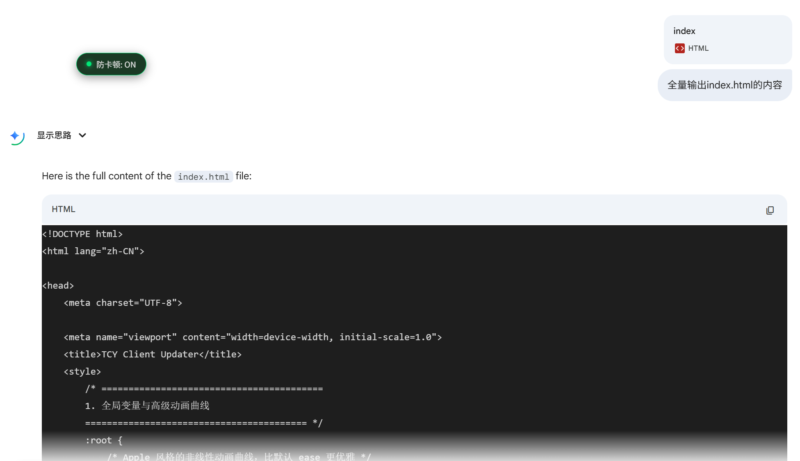
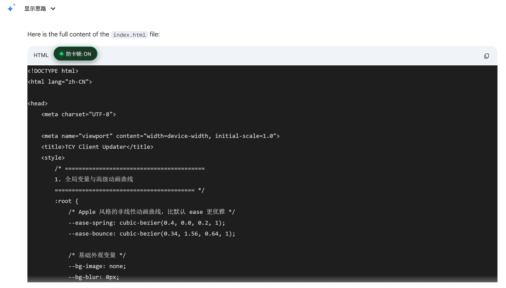
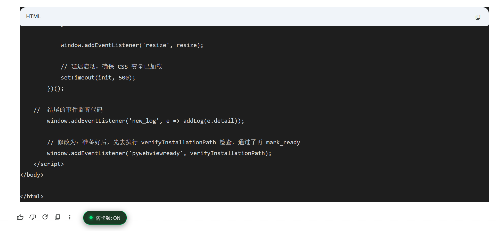
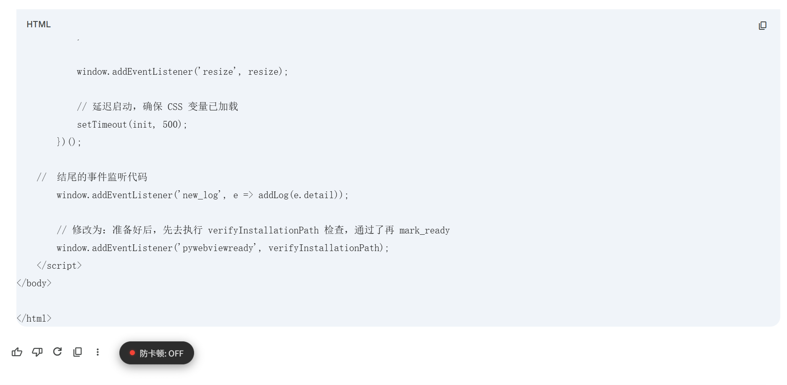

# Gemini 代碼塊防卡頓

[简体中文](readme_zh-Hans.md) | [繁體中文](readme_zh-Hant.md)| [English](readme.md) 

 


 

這是一個針對 Google Gemini 網頁版的效能最佳化腳本。旨在解決 Gemini 在輸出長程式碼（通常超過 1000 行）時，因前端語法高亮渲染機制導致的瀏覽器嚴重卡頓、頁面無回應及滑鼠操作延遲問題。

即使在使用頂級硬體（如 AMD Ryzen 9 9950X3D + 5090d）的情況下，原生網頁在處理大量串流程式碼生成時仍可能因主執行緒阻塞而卡死。本腳本透過暫時簡化 DOM 結構，顯著降低渲染開銷。

## 功能展示

我讓 Gemini 全量輸出我的 index.html（有 2000 多行程式碼）來測試我們腳本的功能。


打開腳本（顯示為「防卡頓 ON」）後，
程式碼區塊會變為黑底白字，且暫停顯示 Gemini 新生成的內容，但此時實際上仍然在背景正常生成。


等待 Gemini 工作完畢後，它會自動把剛剛暫停顯示的內容全部顯示出來，你可以查看生成的全部結果。


如果你希望恢復頁面的原本渲染方式，可以再點擊一次腳本的開關按鈕，使之關閉（顯示為「防卡頓 OFF」）。


不過如你所見，html 程式碼區塊在恢復後也沒有**顏色高亮**，這不是 bug，而是我們腳本方案的取捨。這是因為為了保證不卡頓，我們在一開始就阻止了瀏覽器對這部分內容的高亮計算。
在關閉腳本後，我們應當希望它恢復。也許會在下個版本嘗試解決。

目前你只能依靠重新整理（F5）頁面來恢復**顏色高亮** qwq

但目前對於 **Markdown、YAML** 等程式碼區塊，並不會受到影響，**顏色高亮**仍能在腳本 OFF 後恢復。

## 功能特性

* **防卡頓模式**：在程式碼生成過程中，將複雜的程式碼區塊臨時替換為純文字節點。這能將瀏覽器的渲染壓力降低 99%，確保在生成數千行程式碼時頁面依然絲般順滑。
* **無損還原**：腳本內建「記憶體快照」機制。在簡化程式碼前會自動備份原始資料。當你需要閱讀或複製程式碼時，關閉開關即可完美還原程式碼的高亮樣式，不會破壞原有內容。
* **非侵入式設計**：提供一個簡潔的懸浮按鈕，支援隨意拖曳，狀態自動記憶，不干擾正常使用。

## 使用效果對比

| 狀態 | 按鈕顯示 | 視覺效果 | 效能表現 | 適用場景 |
| --- | --- | --- | --- | --- |
| 開啟 (ON) | 🟢 防卡頓: ON | 黑底白字 (純文字)<br>移除顏色高亮，字體統一，無陰影特效。 | 極高<br>瀏覽器僅需渲染極少量的 DOM 節點，滑鼠移動流暢。 | 讓 Gemini 寫長程式碼會導致頁面甚至系統卡頓無法操作時。 |
| 關閉 (OFF) | 🔴 防卡頓: OFF | 正常高亮 (彩色)<br>恢復 Gemini 原本的主題配色和語法高亮。 | 正常<br>瀏覽器恢復複雜的渲染邏輯。 | 程式碼生成完畢後，進行閱讀、審查或複製程式碼時。 |

## 安裝方法

1. 在瀏覽器（Chrome/Edge/Firefox）中安裝 **Tampermonkey** 或 **Violentmonkey** 擴充功能。
2. 點擊擴充功能圖示，選擇「添加新腳本」。
3. 將本儲存庫中的 `Gemini Code Block Anti-Lag.js` 程式碼完整複製並貼上到編輯器中。
4. 儲存腳本（Ctrl+S）。
5. **重要提示：安裝完成後，請重新整理一次 Gemini 頁面以載入設定。**

## 技術實現原理

Gemini 網頁版採用串流傳輸（Streaming）輸出內容。每當有新的程式碼字元到達，前端的高亮引擎（如 Prism.js 或 Highlight.js）都會重新計算整個程式碼區塊的 Token 顏色，並建立成千上萬個 `<span>` 標籤。當程式碼量巨大時，頻繁的 DOM 操作（Reflow/Repaint）會徹底佔滿 UI 主執行緒。

本腳本採用了 **「物理簡化 + 快照還原」** 的策略來解決此問題：

1. **監聽 (Monitor)**：使用 `MutationObserver` 實時監控 DOM 樹，專門鎖定 `<pre>` 程式碼區塊標籤。
2. **備份 (Snapshot)**：在對節點進行任何操作前，腳本會將當前的 `innerHTML`（包含高亮結構）備份到元素的 `dataset` 屬性中。
3. **簡化 (Simplify)**：強制執行 `el.textContent = el.innerText`。這一步會瞬間銷毀內部所有複雜的子節點（span），只保留純文字內容。此時瀏覽器的渲染複雜度從 $O(n)$ 降為 $O(1)$。
4. **還原 (Restore)**：當使用者關閉開關時，腳本從備份中讀取原始 HTML 並重新注入，同時清除腳本施加的所有臨時樣式，將控制權交還給 Gemini 原生 CSS。

## 注意事項

* **串流內容的還原限制**：如果在腳本 **開啟狀態下** Gemini 生成了新的程式碼內容，這部分內容在 **關閉腳本後** 會恢復正常的背景色和字體，但可能**不會擁有顏色高亮**。這是因為為了保證不卡頓，我們在一開始就阻止了瀏覽器對這部分內容的高亮計算。
* **歷史內容的還原**：在腳本開啟前就已經存在的歷史對話程式碼，可以 100% 完美還原。

## 授權條款 (License)

本專案採用 [MIT License](https://www.google.com/search?q=LICENSE) 開源。

```text
MIT License

Copyright (c) 2026 KanameMadoka520

Permission is hereby granted, free of charge, to any person obtaining a copy
of this software and associated documentation files (the "Software"), to deal
in the Software without restriction, including without limitation the rights
to use, copy, modify, merge, publish, distribute, sublicense, and/or sell
copies of the Software, and to permit persons to whom the Software is
furnished to do so, subject to the following conditions:

The above copyright notice and this permission notice shall be included in all
copies or substantial portions of the Software.